# Site Interlinking Graph

This document maps every page as a node and every navigational link as a directed edge.
Use it to identify orphan pages, thin link clusters, and interlinking opportunities.

## Notation

- **Solid arrow** `-->` = existing structural parent to child link (nav / index page)
- **Dashed arrow** `-.->` = cross-section link that should be added (interlinking target)
- Node IDs are short aliases; labels show the actual URL slug

---

## Full Site Graph

```mermaid
graph TD

  HOME["/"]

  %% Custom Apparel
  HOME --> CA["/custom-apparel"]

  CA --> CA_PO_DTF["/printing-options/dtf-printing"]
  CA --> CA_PO_DYE["/printing-options/dye-sublimation-printing"]
  CA --> CA_PO_SCR["/printing-options/screen-printing"]
  CA --> CA_PO_EMB["/printing-options/embroidery"]
  CA --> CA_PO_RHI["/printing-options/rhinestone-apparel"]
  CA --> CA_PO_VIN["/printing-options/digital-vinyl"]

  CA --> CA_SM_GLI["/specialty-materials/glitter-shirts"]
  CA --> CA_SM_PUF["/specialty-materials/puff-shirts"]
  CA --> CA_SM_GLO["/specialty-materials/glow-in-the-dark-shirts"]
  CA --> CA_SM_FLO["/specialty-materials/flock-shirts"]
  CA --> CA_SM_BRI["/specialty-materials/brick-shirts"]
  CA --> CA_SM_HOL["/specialty-materials/holographic-shirts"]
  CA --> CA_SM_FOI["/specialty-materials/foil-shirts"]
  CA --> CA_SM_REF["/specialty-materials/reflective-shirts"]
  CA --> CA_SM_VIN["/specialty-materials/vinyl"]

  CA --> CA_GW_REU["/group-wear/reunion-shirts"]
  CA --> CA_GW_SPI["/group-wear/spirit-wear-shirts"]
  CA --> CA_GW_COR["/group-wear/corporate-wear-shirts"]

  %% Signs
  HOME --> SGN["/signs"]

  SGN --> SGN_BAN["/business-signs/banners"]
  SGN --> SGN_WIN["/business-signs/window-signs"]
  SGN --> SGN_WAL["/business-signs/wall-signs"]
  SGN --> SGN_FLR["/business-signs/floor-signs"]
  SGN --> SGN_DOR["/business-signs/door-signs"]
  SGN --> SGN_POS["/business-signs/posters"]

  SGN --> SGN_YRD["/ground-signs/yard-signs"]
  SGN --> SGN_SWK["/ground-signs/sidewalk-signs"]
  SGN --> SGN_AFR["/ground-signs/sidewalk-signs-a-frame-signs"]

  SGN --> SGN_TCL["/table-signs/table-cloths"]
  SGN --> SGN_TRN["/table-signs/table-runners"]

  %% Stickers
  HOME --> STK["/stickers"]
  STK --> STK_STD["/stickers/standard-stickers-decals"]
  STK --> STK_SHA["/stickers/custom-shaped-stickers-decals"]

  %% Vehicle Graphics
  HOME --> VG["/vehicle-graphics"]
  VG --> VG_AUTO["/vehicle-graphics/automobile-graphics"]
  VG --> VG_MAG["/vehicle-graphics/vehicle-magnets"]
  VG --> VG_DOT["/vehicle-graphics/dot-decals"]

  %% Promotional Items
  HOME --> PI["/promotional-items"]
  PI --> PI_MUG["/promotional-items/mugs"]
  PI --> PI_KOO["/promotional-items/can-koozies"]
  PI --> PI_TOW["/promotional-items/towels"]
  PI --> PI_COA["/promotional-items/drink-coasters"]
  PI --> PI_TOT["/promotional-items/tote-bags"]
  PI --> PI_MOU["/promotional-items/mouse-pads"]

  %% Design Services
  HOME --> DS["/design-services"]
  DS --> DS_LOG["/design-services/logo-design"]
  DS --> DS_GFX["/design-services/graphic-design"]
  DS --> DS_STO["/design-services/custom-storefronts"]

  %% Service Areas
  HOME --> SA["/service-areas"]
  SA --> SA_DYN["/service-areas/{city-slug}"]

  %% Company
  HOME --> ABT["/about-us"]
  HOME --> PRT["/portfolio"]
  HOME --> CON["/contact"]
  HOME --> ART["/articles"]
  HOME --> REV["/reviews"]

  %% E-Commerce
  HOME --> MERCH["/top5pct-merchandise"]
  HOME --> CART["/cart"]
  HOME --> CHKT["/checkout"]
  MERCH --> COL["/collections/{slug}"]
  COL --> COL_C["/collections/{parent}/{child}"]
  COL_C --> PROD["/products/{slug}"]
  PROD --> CART
  CART --> CHKT

  %% Legal
  HOME -.-> PRIV["/privacy-policy"]
  HOME -.-> TOU["/terms-of-use"]
```

---

## Cross-Section Links to Add

These are high-value interlinking edges that do not yet exist.
Each row is a proposed `source --> target` link with a suggested anchor context.

| # | Source page | Target page | Suggested anchor context |
|---|---|---|---|
| 1 | `/custom-apparel/printing-options/screen-printing` | `/custom-apparel/printing-options/embroidery` | "Add embroidery to complement your screen print order" |
| 2 | `/custom-apparel/printing-options/screen-printing` | `/custom-apparel/group-wear/reunion-shirts` | "Screen printing is ideal for reunion shirt bulk orders" |
| 3 | `/custom-apparel/printing-options/screen-printing` | `/custom-apparel/group-wear/spirit-wear-shirts` | "Most popular technique for school spirit wear" |
| 4 | `/custom-apparel/printing-options/embroidery` | `/custom-apparel/group-wear/corporate-wear-shirts` | "Embroidery is the standard for corporate wear" |
| 5 | `/custom-apparel/printing-options/embroidery` | `/custom-apparel/printing-options/screen-printing` | "Compare embroidery to screen printing" |
| 6 | `/custom-apparel/printing-options/rhinestone-apparel` | `/custom-apparel/group-wear/reunion-shirts` | "Rhinestone shirts are popular for family reunions" |
| 7 | `/custom-apparel/printing-options/dtf-printing` | `/custom-apparel/printing-options/screen-printing` | "Compare DTF to screen printing for your order" |
| 8 | `/custom-apparel/group-wear/reunion-shirts` | `/custom-apparel/group-wear/spirit-wear-shirts` | "Also popular for group orders" |
| 9 | `/custom-apparel/group-wear/reunion-shirts` | `/custom-apparel/group-wear/corporate-wear-shirts` | "Need corporate wear for your organization?" |
| 10 | `/custom-apparel/group-wear/spirit-wear-shirts` | `/custom-apparel/group-wear/reunion-shirts` | "Reunion shirts and group event apparel" |
| 11 | `/custom-apparel/group-wear/corporate-wear-shirts` | `/custom-apparel/printing-options/embroidery` | "Embroidery is our most popular corporate finish" |
| 12 | `/custom-apparel/specialty-materials/glitter-shirts` | `/custom-apparel/printing-options/rhinestone-apparel` | "Compare glitter to rhinestone for your look" |
| 13 | `/custom-apparel/specialty-materials/holographic-shirts` | `/custom-apparel/specialty-materials/foil-shirts` | "Foil shirts for a similar metallic effect" |
| 14 | `/custom-apparel/specialty-materials/foil-shirts` | `/custom-apparel/specialty-materials/holographic-shirts` | "Holographic shirts for a color-shifting alternative" |
| 15 | `/custom-apparel/specialty-materials/flock-shirts` | `/custom-apparel/printing-options/screen-printing` | "Screen printing for high-volume versions of this design" |
| 16 | `/custom-apparel/specialty-materials/reflective-shirts` | `/custom-apparel/group-wear/corporate-wear-shirts` | "Popular for safety uniforms and work crews" |
| 17 | `/signs/business-signs/banners` | `/signs/business-signs/window-signs` | "Window signs to complement your banner" |
| 18 | `/signs/business-signs/banners` | `/signs/ground-signs/yard-signs` | "Yard signs for outdoor events alongside banners" |
| 19 | `/signs/business-signs/window-signs` | `/signs/business-signs/wall-signs` | "Interior wall signs to match your window signage" |
| 20 | `/signs/business-signs/wall-signs` | `/signs/business-signs/door-signs` | "Door signs to complete your interior sign package" |
| 21 | `/signs/business-signs/door-signs` | `/signs/business-signs/window-signs` | "Window signs for the full storefront look" |
| 22 | `/signs/business-signs/posters` | `/signs/business-signs/banners` | "Scale up to banners for larger displays" |
| 23 | `/signs/ground-signs/yard-signs` | `/signs/ground-signs/sidewalk-signs` | "Sidewalk signs for foot traffic near your yard signs" |
| 24 | `/signs/ground-signs/sidewalk-signs` | `/signs/ground-signs/sidewalk-signs-a-frame-signs` | "A-frame signs as a heavier-duty alternative" |
| 25 | `/signs/ground-signs/sidewalk-signs-a-frame-signs` | `/signs/ground-signs/yard-signs` | "Yard signs for a lighter, stake-mounted option" |
| 26 | `/signs/table-signs/table-cloths` | `/signs/table-signs/table-runners` | "Table runners to pair with your table cloth" |
| 27 | `/signs/table-signs/table-runners` | `/signs/table-signs/table-cloths` | "Full table cloths for complete event coverage" |
| 28 | `/vehicle-graphics/automobile-graphics` | `/vehicle-graphics/vehicle-magnets` | "Magnets for a removable alternative to full wraps" |
| 29 | `/vehicle-graphics/automobile-graphics` | `/signs/business-signs/banners` | "Banners and signage to match your vehicle graphics" |
| 30 | `/vehicle-graphics/vehicle-magnets` | `/vehicle-graphics/automobile-graphics` | "Full wraps for permanent vehicle branding" |
| 31 | `/vehicle-graphics/dot-decals` | `/vehicle-graphics/automobile-graphics` | "Full vehicle graphics for commercial fleets" |
| 32 | `/stickers/standard-stickers-decals` | `/stickers/custom-shaped-stickers-decals` | "Die-cut shaped stickers for a custom contour" |
| 33 | `/stickers/custom-shaped-stickers-decals` | `/vehicle-graphics/automobile-graphics` | "Scale up to full vehicle graphics" |
| 34 | `/stickers/custom-shaped-stickers-decals` | `/stickers/standard-stickers-decals` | "Standard stickers for simpler bulk orders" |
| 35 | `/promotional-items/tote-bags` | `/custom-apparel/printing-options/screen-printing` | "Screen print your totes to match your shirts" |
| 36 | `/promotional-items/mugs` | `/promotional-items/tote-bags` | "Build a complete branded merchandise set" |
| 37 | `/promotional-items/can-koozies` | `/promotional-items/towels` | "Towels and koozies — a natural pair for events" |
| 38 | `/promotional-items/towels` | `/promotional-items/can-koozies` | "Can koozies to complete your event giveaway kit" |
| 39 | `/promotional-items/mouse-pads` | `/promotional-items/mugs` | "Branded mugs for the full desk set" |
| 40 | `/promotional-items/drink-coasters` | `/promotional-items/mugs` | "Custom mugs to pair with your coasters" |
| 41 | `/design-services/logo-design` | `/design-services/graphic-design` | "Full graphic design services available" |
| 42 | `/design-services/logo-design` | `/custom-apparel/group-wear/corporate-wear-shirts` | "Put your new logo on branded corporate wear" |
| 43 | `/design-services/graphic-design` | `/design-services/logo-design` | "Need a logo first? Start here" |
| 44 | `/design-services/custom-storefronts` | `/design-services/logo-design` | "Logo design for your storefront brand" |
| 45 | `/about-us` | `/contact` | "Get in touch with our team" |
| 46 | `/about-us` | `/reviews` | "See what our customers say" |
| 47 | `/reviews` | `/contact` | "Ready to start your order?" |
| 48 | `/portfolio` | `/contact` | "Like what you see? Start your project" |
| 49 | `/service-areas/{slug}` | `/contact` | "Request a quote for [City]" |
| 50 | `/service-areas/{slug}` | `/custom-apparel` | "Custom apparel available for [City] pickup and delivery" |
| 51 | `/service-areas/{slug}` | `/signs` | "Custom signs serving [City]" |

---

## Orphan Risk Pages

Pages with no known inbound cross-section links beyond their parent index. These need the most attention.

| Page | Current inbound links | Priority |
|---|---|---|
| `/custom-apparel/specialty-materials/brick-shirts` | Parent index only | High |
| `/custom-apparel/specialty-materials/puff-shirts` | Parent index only | High |
| `/custom-apparel/specialty-materials/glow-in-the-dark-shirts` | Parent index only | High |
| `/custom-apparel/specialty-materials/vinyl` | Parent index only | Medium |
| `/signs/business-signs/floor-signs` | Parent index only | Medium |
| `/vehicle-graphics/dot-decals` | Parent index only | Medium |
| `/promotional-items/drink-coasters` | Parent index only | Medium |
| `/promotional-items/mouse-pads` | Parent index only | Medium |
| `/design-services/custom-storefronts` | Parent index only | Medium |
| `/articles` | Nav only | Low |
| `/portfolio` | Nav only | Low |
