# Site Interlinking Graph

This document maps every page as a node and every navigational link as a directed edge.
For the full link-by-link implementation plan — anchor text, placement, status, and target
sections — see [`docs/top5pct_interlinking_strategy.md`](./top5pct_interlinking_strategy.md).

---

## Notation

- **Solid arrow** `-->` = existing structural parent to child link (nav / index page)
- **Dashed arrow** `-.->` = cross-section link that should be added (interlinking target)
- Node IDs are short aliases; labels show the actual URL slug

---

## Full Site Graph

```mermaid
graph TD

  HOME["/"]

  %% Custom Apparel
  HOME --> CA["/custom-apparel"]

  CA --> CA_PO_DTF["/printing-options/dtf-printing"]
  CA --> CA_PO_DYE["/printing-options/dye-sublimation-printing"]
  CA --> CA_PO_SCR["/printing-options/screen-printing"]
  CA --> CA_PO_EMB["/printing-options/embroidery"]
  CA --> CA_PO_RHI["/printing-options/rhinestone-apparel"]
  CA --> CA_PO_VIN["/printing-options/digital-vinyl"]

  CA --> CA_SM_GLI["/specialty-materials/glitter-shirts"]
  CA --> CA_SM_PUF["/specialty-materials/puff-shirts"]
  CA --> CA_SM_GLO["/specialty-materials/glow-in-the-dark-shirts"]
  CA --> CA_SM_FLO["/specialty-materials/flock-shirts"]
  CA --> CA_SM_BRI["/specialty-materials/brick-shirts"]
  CA --> CA_SM_HOL["/specialty-materials/holographic-shirts"]
  CA --> CA_SM_FOI["/specialty-materials/foil-shirts"]
  CA --> CA_SM_REF["/specialty-materials/reflective-shirts"]
  CA --> CA_SM_VIN["/specialty-materials/vinyl"]

  CA --> CA_GW_REU["/group-wear/reunion-shirts"]
  CA --> CA_GW_SPI["/group-wear/spirit-wear-shirts"]
  CA --> CA_GW_COR["/group-wear/corporate-wear-shirts"]

  %% Signs
  HOME --> SGN["/signs"]

  SGN --> SGN_BAN["/business-signs/banners"]
  SGN --> SGN_WIN["/business-signs/window-signs"]
  SGN --> SGN_WAL["/business-signs/wall-signs"]
  SGN --> SGN_FLR["/business-signs/floor-signs"]
  SGN --> SGN_DOR["/business-signs/door-signs"]
  SGN --> SGN_POS["/business-signs/posters"]

  SGN --> SGN_YRD["/ground-signs/yard-signs"]
  SGN --> SGN_SWK["/ground-signs/sidewalk-signs"]
  SGN --> SGN_AFR["/ground-signs/sidewalk-signs-a-frame-signs"]

  SGN --> SGN_TCL["/table-signs/table-cloths"]
  SGN --> SGN_TRN["/table-signs/table-runners"]

  %% Stickers
  HOME --> STK["/stickers"]
  STK --> STK_STD["/stickers/standard-stickers-decals"]
  STK --> STK_SHA["/stickers/custom-shaped-stickers-decals"]

  %% Vehicle Graphics
  HOME --> VG["/vehicle-graphics"]
  VG --> VG_AUTO["/vehicle-graphics/automobile-graphics"]
  VG --> VG_MAG["/vehicle-graphics/vehicle-magnets"]
  VG --> VG_DOT["/vehicle-graphics/dot-decals"]

  %% Promotional Items
  HOME --> PI["/promotional-items"]
  PI --> PI_MUG["/promotional-items/mugs"]
  PI --> PI_KOO["/promotional-items/can-koozies"]
  PI --> PI_TOW["/promotional-items/towels"]
  PI --> PI_COA["/promotional-items/drink-coasters"]
  PI --> PI_TOT["/promotional-items/tote-bags"]
  PI --> PI_MOU["/promotional-items/mouse-pads"]

  %% Design Services
  HOME --> DS["/design-services"]
  DS --> DS_LOG["/design-services/logo-design"]
  DS --> DS_GFX["/design-services/graphic-design"]
  DS --> DS_STO["/design-services/custom-storefronts"]

  %% Service Areas
  HOME --> SA["/service-areas"]
  SA --> SA_DYN["/service-areas/{city-slug}"]

  %% Company
  HOME --> ABT["/about-us"]
  HOME --> PRT["/portfolio"]
  HOME --> CON["/contact"]
  HOME --> ART["/articles"]
  HOME --> REV["/reviews"]

  %% E-Commerce
  HOME --> MERCH["/top5pct-merchandise"]
  HOME --> CART["/cart"]
  HOME --> CHKT["/checkout"]
  MERCH --> COL["/collections/{slug}"]
  COL --> COL_C["/collections/{parent}/{child}"]
  COL_C --> PROD["/products/{slug}"]
  PROD --> CART
  CART --> CHKT

  %% Legal
  HOME -.-> PRIV["/privacy-policy"]
  HOME -.-> TOU["/terms-of-use"]
```



---

## Link HTML Convention

All interlinks added during this project use the following class:

```html
<a href="/target-url" class="link-notification">anchor text</a>
```

**Rules:**
- Class `link-notification` must appear on every cross-section interlink — no exceptions.
- Never add `target="_blank"` — all links are internal.
- Anchor text must match the exact wording shown in `top5pct_interlinking_strategy.md`.
- Never wrap an entire sentence — link only the specific anchor phrase.
- No all-caps in anchor text (site-wide rule).

---

## Implementation Process

All link locations, anchor text, and target sections are defined in
[`docs/top5pct_interlinking_strategy.md`](./top5pct_interlinking_strategy.md).
This section describes only the mechanical process of applying them.

### File locations

Each page in the strategy doc maps to a Blade file in `resources/views/pages/`.

| Strategy doc section | Blade file path |
|---|---|
| `①` `/` | `resources/views/pages/home.blade.php` |
| `②` `/custom-apparel` | `resources/views/pages/custom-apparel/index.blade.php` |
| `③` `/custom-apparel/printing-options/dtf-printing` | `resources/views/pages/custom-apparel/dtf-transfers.blade.php` |
| `④` `/custom-apparel/printing-options/dye-sublimation-printing` | `resources/views/pages/custom-apparel/dye-sublimation.blade.php` |
| `⑤` `/custom-apparel/printing-options/screen-printing` | `resources/views/pages/custom-apparel/printing-options/screen-printing.blade.php` |
| `⑥` `/custom-apparel/printing-options/embroidery` | `resources/views/pages/custom-apparel/printing-options/embroidery.blade.php` |
| `⑦` `/custom-apparel/printing-options/rhinestone-apparel` | `resources/views/pages/custom-apparel/printing-options/rhinestone-apparel.blade.php` |
| `⑧` `/custom-apparel/printing-options/digital-vinyl` | `resources/views/pages/custom-apparel/printing-options/digital-vinyl.blade.php` |
| `⑨` `/custom-apparel/specialty-materials/glitter-shirts` | `resources/views/pages/custom-apparel/glitter-shirts.blade.php` |
| `⑩` `/custom-apparel/specialty-materials/puff-shirts` | `resources/views/pages/custom-apparel/puff-shirts.blade.php` |
| `⑪` `/custom-apparel/specialty-materials/glow-in-the-dark-shirts` | `resources/views/pages/custom-apparel/glow-in-the-dark-shirts.blade.php` |
| `⑫` `/custom-apparel/specialty-materials/flock-shirts` | `resources/views/pages/custom-apparel/flock-shirts.blade.php` |
| `⑬` `/custom-apparel/specialty-materials/brick-shirts` | `resources/views/pages/custom-apparel/brick-shirts.blade.php` |
| `⑭` `/custom-apparel/specialty-materials/holographic-shirts` | `resources/views/pages/custom-apparel/holographic-shirts.blade.php` |
| `⑮` `/custom-apparel/specialty-materials/foil-shirts` | `resources/views/pages/custom-apparel/foil-shirts.blade.php` |
| `⑯` `/custom-apparel/specialty-materials/reflective-shirts` | `resources/views/pages/custom-apparel/reflective-shirts.blade.php` |
| `⑰` `/custom-apparel/group-wear/reunion-shirts` | `resources/views/pages/custom-apparel/group-wear/reunion-shirts.blade.php` |
| `⑱` `/custom-apparel/group-wear/spirit-wear-shirts` | `resources/views/pages/custom-apparel/group-wear/spirit-wear-shirts.blade.php` |
| `⑲` `/custom-apparel/group-wear/corporate-wear-shirts` | `resources/views/pages/custom-apparel/group-wear/corporate-wear-shirts.blade.php` |
| `⑳` `/signs` | `resources/views/pages/signs/index.blade.php` |
| `㉑` `/signs/business-signs/banners` | `resources/views/pages/signs/banners.blade.php` |
| `㉒` `/signs/business-signs/window-signs` | `resources/views/pages/signs/window-signs.blade.php` |
| `㉓` `/signs/business-signs/wall-signs` | `resources/views/pages/signs/wall-signs.blade.php` |
| `㉔` `/signs/business-signs/floor-signs` | `resources/views/pages/signs/floor-signs.blade.php` |
| `㉕` `/signs/business-signs/door-signs` | `resources/views/pages/signs/door-signs.blade.php` |
| `㉖` `/signs/business-signs/posters` | `resources/views/pages/signs/posters.blade.php` |
| `㉗` `/signs/ground-signs/yard-signs` | `resources/views/pages/signs/yard-signs.blade.php` |
| `㉘` `/signs/ground-signs/sidewalk-signs` | `resources/views/pages/signs/sidewalk-signs.blade.php` |
| `㉙` `/signs/table-signs/table-cloths` | `resources/views/pages/signs/table-cloths.blade.php` |
| `㉚` `/signs/table-signs/table-runners` | `resources/views/pages/signs/table-runners.blade.php` |
| `㉛` `/stickers` | `resources/views/pages/stickers/index.blade.php` |
| `㉜` `/stickers/standard-stickers-decals` | `resources/views/pages/stickers/standard-stickers.blade.php` |
| `㉝` `/stickers/custom-shaped-stickers-decals` | `resources/views/pages/stickers/custom-shaped-stickers.blade.php` |
| `㉞` `/vehicle-graphics` | `resources/views/pages/vehicle-graphics/index.blade.php` |
| `㉟` `/vehicle-graphics/automobile-graphics` | `resources/views/pages/vehicle-graphics/automobile-graphics.blade.php` |
| `㊱` `/vehicle-graphics/vehicle-magnets` | `resources/views/pages/vehicle-graphics/vehicle-magnets.blade.php` |
| `㊲` `/vehicle-graphics/dot-decals` | `resources/views/pages/vehicle-graphics/dot-decals.blade.php` |
| `㊳` `/promotional-items` | `resources/views/pages/promotional-items.blade.php` |
| remaining promo sub-pages | `resources/views/pages/promotional-items/{slug}.blade.php` |
| `/design-services/*` | `resources/views/pages/design-services/{slug}.blade.php` |
| `/about-us`, `/reviews`, `/portfolio` | `resources/views/pages/about.blade.php`, `reviews.blade.php`, `portfolio.blade.php` |
| `/service-areas/{slug}` | `resources/views/pages/service-areas/show.blade.php` |

### Steps per page

1. Open the Blade file for the page.
2. Find the section named in the strategy doc (match by the heading text or component name).
3. For **✅ EXISTING** entries — locate the exact anchor phrase in the existing copy and wrap it:
   ```html
   <a href="/target-url" class="link-notification">anchor text</a>
   ```
4. For **➕ ADD** entries — insert the full new sentence at the noted location, with the anchor already wrapped.
5. Verify the page loads with no Blade errors before moving to the next page.
6. Work through pages in strategy doc order (① to end) to track progress linearly.

### Shared section components

Some sections (e.g. `x-sections.faq`, `x-sections.card-image-with-text`) are shared Blade components,
not inline in the page file. If the target text lives in a component, locate it in
`resources/views/components/sections/` and edit it there — but only if that component is not shared
across multiple pages with different content. If it is shared, the link belongs in the page-level
slot or include, not inside the component itself.

---

## Orphan Risk Pages

Pages with no inbound cross-section links beyond their parent index.
The strategy doc assigns links to most of these — confirm each is covered before closing.

| Page | Current inbound links | Priority |
|---|---|---|
| `/custom-apparel/specialty-materials/brick-shirts` | Parent index only | High |
| `/custom-apparel/specialty-materials/puff-shirts` | Parent index only | High |
| `/custom-apparel/specialty-materials/glow-in-the-dark-shirts` | Parent index only | High |
| `/custom-apparel/specialty-materials/vinyl` | Parent index only | Medium |
| `/signs/business-signs/floor-signs` | Parent index only | Medium |
| `/vehicle-graphics/dot-decals` | Parent index only | Medium |
| `/promotional-items/drink-coasters` | Parent index only | Medium |
| `/promotional-items/mouse-pads` | Parent index only | Medium |
| `/design-services/custom-storefronts` | Parent index only | Medium |
| `/articles` | Nav only | Low |
| `/portfolio` | Nav only | Low |
